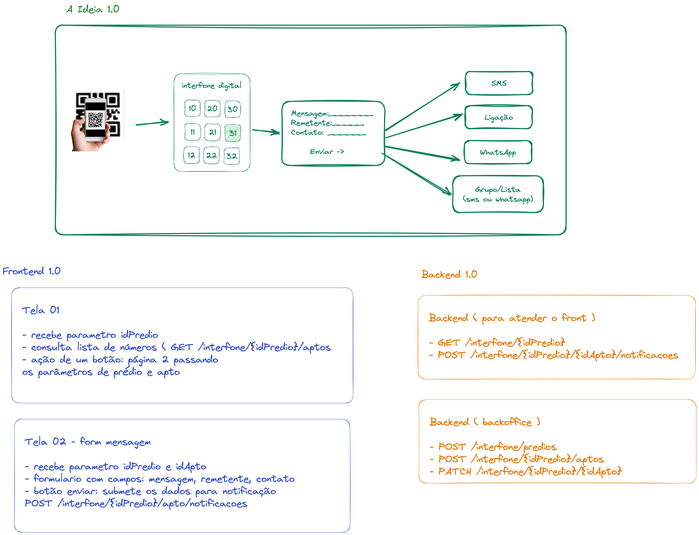

# porteiro-digital
Projeto de estudo para galera mostrar seu pontencial! A ideia é desenvolver um porteiro digital onde a partir de um qrcode os visitantes e entregadores consigam notificar ou falar com os moradores rapidamente.

